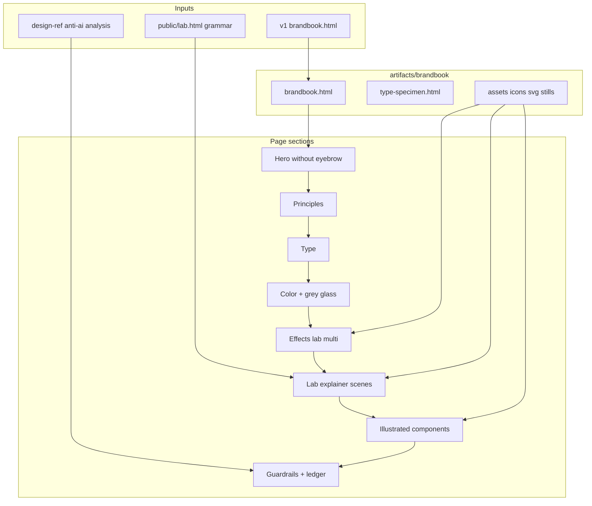

# feat: Brandbook v2 — illustrative, anti-slop specimen

**Target repo:** zbs-site  
**Created:** 2026-07-14  
**Origin:** Nik UX review of micro-brandbook v1 (design-explore session) + `public/lab.html` explainer as reference for "rich visual"

---

## Goal Capsule

Make **brandbook v2** answer "what does zbs *look* like when it is not AI-slop?" by turning the page from a **token pamphlet** into an **illustrated specimen lab**: multiple live effect demos (not one ASCII teaser), a **lab-style multi-person / multi-context animated explainer**, grey frosted glass, icon/illustration system, and **no default AI typography patterns** (eyebrow kickers, caps card labels). Promote durable files into the repo so they survive `/tmp` eviction.

---

## Problem Frame

**v1 status:**  
`artifacts` currently only in session scratch: brandbook + type specimen under Claude session scratchpad (not in git). Page is well-tokened (near-black, cyan signal, holo, type trio, one ASCII demo, colored glass) but still *reads* as AI-slop: sparse imagery, text-as-layout, small uppercase labels, caps mini-card headers, single effect demo, no "people + contexts" motion grammar from lab.

**User pain (stated):**
1. ASCII animation is good but **one example** — need several.
2. Missing **zbs.gg/lab explainer** pattern: named people, multiple contexts, staged animation.
3. Missing **icons / illustrations / imagery** (SVG and/or Higgsfield MCP).
4. **Eyebrow** (small label above headline) still slop.
5. **Caps card titles** (e.g. Small Parts / Same Grammar) still slop; small dim labels too.
6. Whole page feels like **text pamphlet**, not rich brand book.
7. Need **grey frosted glass** card (not only tinted/colored blur glass).
8. Want **bigger illustrative examples** — cards with pictures/icons.

**Success:** Open brandbook offline or via simple static serve; Nik can point to **≥4 distinct live demos**, **≥1 lab-grade explainer scene**, **≥1 grey glass card system**, **≥6 illustrated component cards**, and **zero default eyebrow/caps-kicker patterns** without reintroducing Inter-only / purple-gradient median.

---

## Product Contract (bootstrap)

### Actors
- **A1 Nik** — owner; judges "face" (anti-slop, richness, lab energy).
- **A2 Implementer agent** — edits HTML/CSS/JS specimen, generates assets.
- **A3 Future site implementer** — will port tokens to `app/page.tsx` later (out of v2 ship).

### Requirements
| ID | Requirement |
|----|-------------|
| R1 | **Kill AI typography tells:** remove / redesign hero eyebrow kickers and section/card labels that are small uppercase dim mono text; card titles not all-caps micro-labels. |
| R2 | **Effects lab ≥4 live stages:** keep ASCII; add ≥3 more (e.g. scramble/typewriter, soft glow pulse, matte glass stack, optional matrix/scanline) with captions + do/don't dose. |
| R3 | **Lab explainer block:** multi-scene animation inspired by `public/lab.html` (people avatars, context tags, stage captions) — brand-story version, not full marketing funnel. |
| R4 | **Glass system:** document + show **neutral grey frosted glass** + existing tinted glass; when to use each. |
| R5 | **Imagery system:** ≥6 illustrated cards (icon OR illustration OR photo/SVG); assets in-repo under `artifacts/brandbook/`. |
| R6 | **Icons:** small consistent icon set (stroke/mono on dark) for sources, privacy, retrieval, emotion — not generic Lucide-dump without rules. |
| R7 | **Promote out of /tmp:** brandbook + specimen + assets live under `artifacts/brandbook/` (canonical) with optional `public/brandbook/` mirror or root link if useful for deploy later. |
| R8 | **Still answers "anti-slop":** keep decision ledger + guardrails; expand with visual proof, not only prose. |
| R9 | **File:// works** without long-lived server (session history: 8777 gets killed). |

### Acceptance Examples
| ID | Example |
|----|---------|
| AE1 | Open `artifacts/brandbook/brandbook.html` in Chrome via file:// — no missing local assets. |
| AE2 | Effects lab shows ≥4 interactive/animated demos without leaving the page. |
| AE3 | Explainer section auto-advances (or has controls) through ≥3 scenes with distinct people/contexts. |
| AE4 | Greyscale glass card is visually distinct from cyan/purple tinted glass. |
| AE5 | No section uses the classic "tiny caps eyebrow above display headline" pattern; card titles are sentence case or display weight, not ALL CAPS micro tags. |
| AE6 | Nik can list 3 visual elements that are *not* pure text (icon, illustration, motion scene). |

### Scope Boundaries
**In:** brandbook HTML/CSS/JS specimen, type specimen update, SVG/icon assets, optional Higgsfield stills if MCP available, UX rewrite of v1 structure, durable path in repo.

**Deferred to Follow-Up Work:**
- Port tokens into live `app/page.tsx` / marketing site (after Nik approves face).
- Full redesign of production lab page.
- Full Figma brand system.

**Outside identity:**
- Removing Ellie from video hero on main site (explicit: keep).
- Replacing lab product story with different product.

### Assumptions
- v1 HTML in session scratchpad is the starting point to copy into `artifacts/brandbook/`.
- Lab motion grammar from `public/lab.html` is the reference for explainer density (not Inter font from lab — brand type stays Bricolage / Instrument / IBM Plex Mono).
- Higgsfield MCP optional; if unavailable, ship SVG-first illustrations and note gap.
- Product Contract unchanged after bootstrap (user rant = contract).

---

## Key Technical Decisions

1. **Canonical location = `artifacts/brandbook/`**  
   Durable in-repo, not Claude `/tmp`. Self-contained relative assets (`./assets/...`) so file:// works.  
   *Why:* v1 died with process kill + tmp risk.

2. **Single-file HTML preferred for specimen shell; assets split**  
   Keep one `brandbook.html` for portability; images/SVG in `assets/`. Minimal JS for scenes.  
   *Why:* no Next build dependency; matches v1 success mode.

3. **Lab explainer = simplified stage machine, not copy-paste lab.html**  
   Reuse *interaction pattern* (scenes, people chips, context tags, captions, dots) with brand tokens; drop Inter and marketing CTAs.  
   *Why:* user asked for that *feeling*, not a second lab landing.

4. **Typography anti-slop rules are hard constraints**  
   - Ban: `.eyebrow` / kicker / `text-transform: uppercase` on section labels and card titles.  
   - Prefer: large sentence-case titles; mono only for data/code/stage chrome.  
   *Why:* user explicitly flagged these as still-slop.

5. **Illustration pipeline: SVG first, Higgsfield second**  
   Default icons/illustrations as inline or `assets/*.svg`. Higgsfield stills only for 1–3 hero mood images if available.  
   *Why:* offline reliability + brand control; user named both options.

6. **Grey glass = first-class surface token**  
   e.g. `background: rgba(255,255,255,.04–.08); backdrop-filter: blur(...); border: 1px solid rgba(255,255,255,.08)` without hue tint.  
   *Why:* user said colored blur exists; neutral glass missing.

---

## High-Level Technical Design



**Directional scene machine (explainer):**  
`sceneIndex 0..n-1` → set active scene class → update people row, context tags, caption, progress dots. Interval ~4–6s; pause on hover; optional prev/next.

---

## Implementation Units

### U1. Promote v1 into repo + baseline freeze

**Goal:** Stop losing work to `/tmp`; establish editable baseline.  
**Requirements:** R7  
**Dependencies:** none  
**Files:**
- create `artifacts/brandbook/brandbook.html` (copy from session scratchpad v1)
- create `artifacts/brandbook/type-specimen.html`
- create `artifacts/brandbook/README.md` (how to open file://, purpose, out of scope)
- create `artifacts/brandbook/assets/.gitkeep`

**Approach:** Copy as-is first; no redesign in this unit. Fix only broken absolute font paths if any for file://.  
**Test expectation:** none — scaffolding; verify files exist and open.  
**Verification:** files present; open brandbook.html shows v1 content.

---

### U2. UX rewrite of structure + kill slop typography patterns

**Goal:** Page hierarchy no longer triggers AI-slop pattern recognition.  
**Requirements:** R1, R8, AE5  
**Dependencies:** U1  
**Files:**
- modify `artifacts/brandbook/brandbook.html`
- modify `artifacts/brandbook/type-specimen.html` if it uses same eyebrow/caps

**Approach:**
- Remove or replace `.eyebrow` / kickers with alternatives (section numbers as large display figures, or plain sentence-case section titles only).
- Card headers: sentence case, larger weight; ban ALL CAPS micro labels as primary card title.
- Re-audit every `text-transform: uppercase` + dim mono combo; allow only for true UI chrome (stage head, badge data), not marketing section titles.
- Keep tokens (bg, accent, holo, type families) unless they conflict with R1.

**Test scenarios:**
- Happy: grep-level checklist — zero `.eyebrow` classes; card titles not `text-transform: uppercase`.
- Edge: stage chrome may remain mono uppercase; document allowed exceptions in guardrails section.

**Verification:** visual pass + structural checklist in README.

---

### U3. Effects lab expansion (≥4 demos)

**Goal:** Effects are a gallery of working specimens, not a single teaser.  
**Requirements:** R2, AE2  
**Dependencies:** U2  
**Files:**
- modify `artifacts/brandbook/brandbook.html` (CSS/JS stages)
- optional `artifacts/brandbook/assets/fx-*.svg`

**Approach:** Expand section "effects lab" into a grid of stages, each with:
- live canvas/DOM demo
- short caption (what it is for)
- dose rule (do / don't)

Minimum set:
1. ASCII / scramble (keep & polish)
2. Soft glow / signal pulse
3. Matte / grey glass stack (ties U4)
4. Fourth: scanline OR typewriter OR holographic edge (pick one; document)

**Test scenarios:**
- Happy: four demos animate without console errors when opened file://
- Edge: `prefers-reduced-motion: reduce` pauses/disables motion

**Verification:** open page, count live stages ≥4; reduced-motion does not break layout.

---

### U4. Glass system + grey frosted card

**Goal:** Two glass recipes: tinted brand glass vs neutral grey glass.  
**Requirements:** R4, AE4  
**Dependencies:** U2  
**Files:**
- modify `artifacts/brandbook/brandbook.html` (CSS variables + specimen cards)

**Approach:** Tokens e.g. `--glass-neutral`, `--glass-tint-cyan`, `--glass-border`. Side-by-side comparison cards. Rules: neutral for content panels; tinted for "signal" moments only.

**Test scenarios:**
- Happy: both cards visible; neutral has no strong hue cast
- Error: missing backdrop-filter fallback still readable (solid near-black panel)

**Verification:** visual comparison section present.

---

### U5. Lab-style multi-context explainer

**Goal:** Show brand motion grammar like lab: people, contexts, stages.  
**Requirements:** R3, AE3, AE6  
**Dependencies:** U2, U4  
**Files:**
- modify `artifacts/brandbook/brandbook.html`
- create `artifacts/brandbook/assets/avatar-*.svg` (or CSS avatars)
- patterns from `public/lab.html` (read-only reference)

**Approach:** New section "Context explainer" with ≥3 scenes, e.g.:
1. One person · scattered sources (Slack / chat / code)
2. Many people · private vs shared
3. Retrieval · right context in state  

Use brand mono for stage head only; people as colored initials avatars (lab-like), context chips, caption under stage. Autoplay + pause on hover.

**Test scenarios:**
- Happy: scene advances; dots update; captions change
- Edge: manual next still works if interval cleared
- Integration: works offline file:// without network except Google Fonts (document optional self-host later)

**Verification:** AE3; user can describe people/contexts without reading only text walls.

---

### U6. Icon + illustration system on component cards

**Goal:** Rich illustrated component/examples section.  
**Requirements:** R5, R6, AE6  
**Dependencies:** U2  
**Files:**
- create `artifacts/brandbook/assets/icons/*.svg` (≥6)
- optional stills via Higgsfield into `artifacts/brandbook/assets/mood/`
- modify `artifacts/brandbook/brandbook.html` components section

**Approach:**
- Define icon rules (stroke 1.5, 24px, monochrome fg/dim, no multi-color sets).
- Build ≥6 component cards each with: visual (icon/illustration), title (sentence case), one-line use, do/don't.
- If Higgsfield available: 1–2 mood images for hero/explainer backdrop only; never as only content.

**Test scenarios:**
- Happy: all icon paths resolve relative; no broken images
- Edge: SVG inline preferred if path issues on file://

**Verification:** AE6; components section is visually denser than v1 text minicards.

---

### U7. Guardrails, ledger, anti-slop checklist + open instructions

**Goal:** Brandbook answers "how not to look AI" with visual + rules.  
**Requirements:** R8  
**Dependencies:** U2–U6  
**Files:**
- modify `artifacts/brandbook/brandbook.html` (guardrails section)
- modify `artifacts/brandbook/README.md`
- optional link note from `PRODUCT.md` or README root (one line only if useful)

**Approach:** Expand do/don't with explicit bans matching Nik's review (eyebrow, caps labels, single-demo pages, text-only cards). Link decision ledger to sources (`public/lab.html`, anti-AI analysis concepts). Document open path.

**Test scenarios:** none — documentation; checklist is human QA.  
**Verification:** README open path works; guardrails mention grey glass + multi-demo + no eyebrow.

---

## Dependencies / Sequencing

```
U1 → U2 → (U3 ∥ U4 ∥ U6) → U5 → U7
```

U5 after U4 so explainer can use grey glass stage chrome. U6 can parallel U3/U4.

---

## Risks & Mitigation

| Risk | Mitigation |
|------|------------|
| Re-slop by adding purple gradients / Inter | Hard ban in guardrails; keep type trio |
| Lab copy-paste pulls Inter + marketing CTAs | Extract motion grammar only |
| Higgsfield unavailable | SVG-first path is complete without it |
| file:// CORS / font loads | Prefer system fallbacks; optional self-host fonts later |
| Scope creep into full site redesign | U units stop at specimen; port is follow-up |

---

## Verification Contract

1. **Structural:** files under `artifacts/brandbook/`; assets relative.  
2. **Visual QA (Nik):** AE1–AE6.  
3. **Motion:** reduced-motion safe.  
4. **Anti-slop checklist:** no eyebrow pattern; no caps card titles; ≥4 effect demos; grey glass; explainer scenes; illustrated cards.  
5. **Non-regression:** v1 tokens (near-black, cyan signal, holo, type families) preserved unless intentionally changed and ledger-noted.

## Definition of Done

- [ ] Brandbook v2 opens via file:// from repo path  
- [ ] All R1–R9 addressed  
- [ ] AE1–AE6 pass Nik eye  
- [ ] README documents open + scope  
- [ ] No dependency on killed localhost:8777 for viewing  

---

## Sources & Research

- Session scratch v1 brandbook + type specimen (design-explore)  
- `public/lab.html` — multi-person / multi-context explainer  
- `app/page.tsx` — live site motion (scramble, video, glow) — port later  
- Cross-repo concepts: design-ref analysis anti-AI patterns (monochrome+one accent, surface layers, no default Inter/eyebrow cargo cult) — cite as inspiration only; paths not required in this repo  

**External research:** not re-run; anti-slop constraints already established in prior design-explore + design-ref analysis. Implementation-guidance only.

---

## Open Questions (non-blocking)

1. Higgsfield mood stills in v2 or strictly SVG? **Default: SVG-first; stills optional.**  
2. Mirror under `public/brandbook/` for deploy? **Default: artifacts only until approved.**  
3. Self-host fonts vs Google Fonts CDN? **Default: keep CDN with system fallbacks for offline partial.**

---

## Execution Direction

Execution note (overall): **smoke-first visual** — implement by opening the HTML in browser after each unit; no unit-test framework required for static specimen. Prefer characterization screenshots only if Nik asks.
