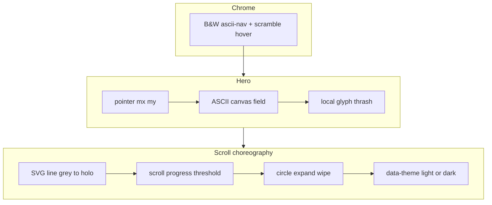

# feat: Brandbook motion — Bayside nav, cursor ASCII, scroll theme wipe

**Target repo:** zbs-site  
**Created:** 2026-07-14  
**Origin:** Nik feedback after brandbook v2.4 — reject liquid/glitch nav direction; want Bayside/landing menu grammar + interactive hero ASCII + researched scroll choreography that flips dark↔light.

**Product Contract preservation:** bootstrap from user rant (no separate brainstorm). Scope = brandbook specimen first; site port deferred.

---

## Goal Capsule

Make **brandbook v2.5** feel like the zbs landing face, not a glass UI kit: **B&W mono nav that scrambles on hover** (as on Bayside/home), **ASCII field under the hero that reacts to the cursor by changing glyphs**, and a **scroll-driven sequence** (SVG progress line grey→holo → expanding white circle wipe → **theme flip dark to light**). Dual theme is first-class: light plates, type, and ASCII must work, not only inverted CSS vars.

---

## Problem Frame

| Current (v2.4) | Wanted |
|----------------|--------|
| Liquid glass pill nav + cyan glare | Black-and-white nav, scramble hover like `app/page.tsx` + `ScrambleText` |
| ASCII is ambient field only | Cursor **disturbs glyphs** under pointer (not only glow brightness) |
| Single dark theme | Dark + light; transition is a **designed scroll moment**, not a toggle in the corner |
| Effects lab noise (glitch/liquid demos) | Keep useful demos; **nav chrome** follows landing, not CodePen glass |

**Reference locks (in-repo):**
- Nav: `app/page.tsx` header + `components/scramble-text.tsx` + `.ascii-nav` / `.topbar` in `app/globals.css` (`mix-blend-mode: difference`, mono, `// ` prefix, dim→fg hover, scramble on pointerenter).
- ASCII + mouse: `components/ascii-bg.tsx` (`mouseGlowEnabled`, radius/intensity) — brandbook canvas should **match or exceed** with **glyph swap / density change** under cursor, not only luminance.
- Brand tokens: near-black / off-white / cyan signal / holo for data edges only.

---

## Product Contract

### Actors
- **A1 Nik** — judges face, scroll moment, dual theme.
- **A2 Implementer** — edits `artifacts/brandbook/brandbook.html` (+ optional shared notes for later site port).

### Requirements
| ID | Requirement |
|----|-------------|
| R1 | **Bayside nav:** black-and-white mono nav; on hover each item **scrambles** then settles (port of `ScrambleText` algorithm/chars); no liquid glass pill as primary chrome. |
| R2 | **Hero ASCII + cursor:** moving pointer over hero changes **ASCII symbols** in a radius (glyph thrash / denser ramp / local reseed), not only soft glow. |
| R3 | **Scroll progress line:** an SVG (or canvas) line along the page (or section spine) that paints from **grey → holographic** as scroll advances. |
| R4 | **Circle theme wipe:** at a defined scroll threshold (or mid-document beat), a **small circle expands** to full viewport white (or black when returning), then **theme switches** dark↔light. |
| R5 | **Dual theme system:** CSS variables for light and dark; plates, type, bento, effects readable in **both**; light is not pure invert of dark without recheck. |
| R6 | **prefers-reduced-motion:** scramble can hard-cut; wipe can hard-cut to theme; ASCII reaction reduces/stops. |
| R7 | **file://** still works; local GSAP optional for wipe if already present. |
| R8 | Document the motion grammar in brandbook guardrails + README. |

### Acceptance Examples
| ID | Example |
|----|---------|
| AE1 | Hover nav item: glyphs scramble then resolve to label; colors stay B&W (cyan only if already in brand lock for active state — default dim→white). |
| AE2 | Move mouse over hero ASCII: local cells visibly change characters within ~radius. |
| AE3 | Scroll page: spine/progress line shifts grey→holo roughly with scroll progress. |
| AE4 | At choreography point: circle expands full-screen and theme is light (or dark on reverse). |
| AE5 | Light theme: body text readable; plates solid; bento still works. |
| AE6 | `prefers-reduced-motion: reduce` — no loop thrash; theme can still be set without long wipe. |

### Scope Boundaries
**In:** `artifacts/brandbook/brandbook.html` (+ README notes); optional small `assets/` if needed; dual-theme CSS; motion scripts.

**Deferred to Follow-Up Work:**
- Port nav/ASCII/wipe into live `app/page.tsx` / production landing.
- Full site light theme redesign beyond brandbook.
- anime.js dependency (prefer port of existing scramble + GSAP/CSS already in brandbook).

**Outside identity:**
- Replacing Elle hero video policy on main site.
- Particle networks / matrix rain / mono marquee.

### Assumptions
- “Bayside” = current zbs home face (ascii-nav + ScrambleText + difference blend), not an external third-party brand kit.
- Theme wipe targets **document theme** for the brandbook page; scroll direction can reverse wipe (light→dark) when scrolling up past threshold.
- Scroll choreography is **one signature beat** mid-page (e.g. after explainer / before parts or after effects lab), not every section.

---

## Key Technical Decisions

1. **Nav = port ScrambleText grammar, not liquid glass**  
   Port algorithm/charset spirit from `components/scramble-text.tsx` into brandbook vanilla JS. Style after `.ascii-nav` / B&W topbar. Kill primary liquid-pill sticky nav from v2.4.  
   *Why:* Nik named that hover scramble as the loved moment.

2. **ASCII cursor = glyph disturbance layer on existing field**  
   Extend brandbook `makeField` (or dedicated hero canvas): track `mx,my`; for cells within radius, boost noise / pick denser ramp char / temporary reseed. Optional soft luminance (as `ascii-bg` glow) **in addition**, not instead.  
   *Why:* “менялись ascii-символы” is explicit.

3. **Theme = `data-theme="dark|light"` on `<html>` + token maps**  
   Dark: current. Light: white/off-white canvas, near-black type, cyan signal, solid light plates / dark plates inverted carefully.  
   *Why:* wipe must land on real dual system.

4. **Scroll beat = progress line + circle wipe**  
   - Progress: fixed or section-bound SVG path/`stroke-dashoffset` tied to `scrollY / maxScroll` or `IntersectionObserver` + scroll progress for a dedicated “theme gate” section.  
   - Wipe: fixed full-viewport layer, `clip-path: circle(r at x y)` or transform scale of circle; on complete set `data-theme` and reset/hide overlay.  
   *Why:* Nik’s choreography is specific; one beat is enough for brandbook.

5. **Research note (planning-time)**  
   Patterns: clip-path circle expand theme toggle; scroll-driven stroke dash; dual CSS variable themes. Prefer no new heavy libraries. GSAP already local for optional timeline on wipe.  
   *Why:* user asked for research as part of the scroll feature; keep evidence in Sources, not a separate product.

6. **Effects lab cleanup**  
   Demote or re-label liquid glass / glitch nav as **optional material demos**, not the page chrome. Primary chrome = Bayside nav.  
   *Why:* avoid mixed signals.

---

## High-Level Technical Design



**Directional wipe sequence (not implementation code):**
1. User scrolls; line dashoffset ∝ progress (0→1).  
2. At progress ≥ T (e.g. 0.45–0.55) or gate section mid: freeze optional scroll lock 0–400ms *or* free-scroll with overlay.  
3. Circle r: 0 → √(w²+h²) from fixed origin (e.g. line tip or viewport center).  
4. On complete: set theme; reverse sequence when scrolling up.

---

## Implementation Units

### U1. Dual theme token system

**Goal:** Brandbook supports dark and light without broken contrast.  
**Requirements:** R5, AE5  
**Dependencies:** none  
**Files:**
- modify `artifacts/brandbook/brandbook.html` (`:root` / `[data-theme="light"]` variables, body/plate/nav/bento colors)
- modify `artifacts/brandbook/README.md` (theme note)

**Approach:** Map canvas, plate, fg, dim, rule, accent for both themes. Light uses near-white canvas + dark type; cyan remains signal. Audit bento nested stages (phone/code) for both.

**Test scenarios:**
- Happy: toggle `data-theme` in DevTools → text readable.
- Edge: holo gradient still readable on light plates.

**Verification:** AE5 visual pass.

---

### U2. Bayside B&W scramble nav (replace liquid chrome)

**Goal:** Nav matches landing love: mono B&W + scramble on hover.  
**Requirements:** R1, AE1  
**Dependencies:** U1 (theme-aware colors)  
**Files:**
- modify `artifacts/brandbook/brandbook.html` (nav markup/CSS/JS)
- patterns: `components/scramble-text.tsx`, `app/globals.css` `.ascii-nav`, `app/page.tsx` header

**Approach:**
- Remove liquid-pill shell as primary sticky chrome (or demote to effects lab only).
- Nav: mono links, dim default, white/near-black hover, optional `// ` prefix.
- Port scramble: hidden measure span + absolute display (layout-stable) **or** fixed-width mono; charset aligned with site `SCRAMBLE_CHARS` (or subset for brandbook).
- Hover/focus triggers scramble once per enter.

**Test scenarios:**
- Happy: hover “Effects” → thrash → “Effects”.
- Edge: rapid hover doesn’t leave stuck garbage (settles to final text).
- Reduced motion: show final text immediately.

**Verification:** AE1; side-by-side feel with live site home nav.

---

### U3. Cursor-reactive hero ASCII glyphs

**Goal:** Moving cursor changes ASCII symbols under the pointer.  
**Requirements:** R2, AE2  
**Dependencies:** none (can parallel U2)  
**Files:**
- modify `artifacts/brandbook/brandbook.html` (hero `#ascii` field JS)
- pattern: `components/ascii-bg.tsx` mouse glow math

**Approach:**
- Track pointer relative to hero canvas.
- Per cell: base field function + local boost when `d2 < r²`: increase noise amplitude, pick higher ramp index, or temporarily force denser glyphs (`#%@▓`).
- Falloff smooth at radius edge; idle when pointer leaves hero.
- Keep `prefers-reduced-motion` → static or freeze field.

**Test scenarios:**
- Happy: move mouse → local glyph chaos under cursor.
- Edge: leave hero → field returns to ambient animation.
- Performance: 60fps on M-series at hero size (cell 12–14px).

**Verification:** AE2.

---

### U4. Scroll progress line (grey → holo)

**Goal:** Signature SVG line paints with scroll.  
**Requirements:** R3, AE3  
**Dependencies:** U1  
**Files:**
- modify `artifacts/brandbook/brandbook.html` (SVG spine + CSS stroke; scroll listener)

**Approach:**
- Vertical or S-curve path fixed left of content or between sections.
- Base stroke grey; overlay stroke holo with `stroke-dasharray` / `dashoffset` from scroll progress.
- Optional dot at tip that feeds U5 origin.

**Test scenarios:**
- Happy: top of page line dim/empty; mid/end more holo.
- Edge: resize recalculates path length.

**Verification:** AE3.

---

### U5. Circle expand wipe + theme flip

**Goal:** Scroll choreography completes theme change via full-screen circle.  
**Requirements:** R4, R5, R6, AE4, AE6  
**Dependencies:** U1, U4  
**Files:**
- modify `artifacts/brandbook/brandbook.html` (fixed wipe layer, scroll gate, theme set)

**Approach:**
- Gate: progress threshold and/or dedicated section `#theme-gate` mid-document.
- Overlay `position:fixed; inset:0; pointer-events:none; z-index: high` with circle clip from tip/center.
- Expand to cover max diagonal; then set `data-theme` and remove/hide overlay (or reverse on scroll up).
- Optional short `history` state / `sessionStorage` so reload remembers theme.
- Reduced motion: set theme at threshold without expand animation.

**Test scenarios:**
- Happy: scroll past gate → white circle → light theme.
- Happy reverse: scroll up → circle (dark) → dark theme.
- Edge: fast scroll doesn’t leave half-open clip.
- Reduced motion: theme flips without multi-second wipe.

**Verification:** AE4, AE6.

---

### U6. Guardrails, effects lab demotion, README

**Goal:** Document motion grammar; stop chrome mixed signals.  
**Requirements:** R8  
**Dependencies:** U2–U5  
**Files:**
- modify `artifacts/brandbook/brandbook.html` (rules + ledger)
- modify `artifacts/brandbook/README.md`

**Approach:**
- Rules: Bayside nav scramble; cursor ASCII; scroll line + circle theme; dual theme required.
- Label liquid/glitch demos as “material experiments — not primary chrome”.
- Open path + how to force theme for QA (`?theme=light`).

**Test expectation:** none — docs + human QA checklist.  
**Verification:** README + guardrails mention all three features.

---

## Dependencies / Sequencing

```
U1 → U2
U1 → U4 → U5
U3 ∥ U2
U2 + U3 + U5 → U6
```

---

## Risks & Mitigation

| Risk | Mitigation |
|------|------------|
| Light theme looks like “invert filter” | Explicit token map; re-audit bento/code panels |
| Wipe fights scroll / jank | Use transform/clip-path on compositor; one gate only |
| ASCII thrash too noisy | Radius + intensity caps; falloff; reduced-motion off |
| Scramble layout shift | Site pattern: hidden measure + absolute overlay |
| Over-scope into full site port | Units stop at brandbook; port is follow-up |

---

## Verification Contract

1. Open `artifacts/brandbook/brandbook.html` file://.  
2. AE1–AE6 visual + interaction.  
3. Dark and light both readable.  
4. Reduced-motion: no infinite thrash; theme still settable.  
5. Non-regression: bento parts and core tokens still present.

## Definition of Done

- [ ] Bayside-style B&W scramble nav is primary chrome  
- [ ] Hero ASCII glyphs react to cursor  
- [ ] Scroll line grey→holo  
- [ ] Circle wipe flips theme dark↔light  
- [ ] README + guardrails updated  
- [ ] file:// works  

---

## Sources & Research

**In-repo (primary):**
- `components/scramble-text.tsx` — scramble algorithm + layout-stable overlay  
- `app/page.tsx` + `app/globals.css` (`.ascii-nav`, `.topbar`) — Bayside/home nav  
- `components/ascii-bg.tsx` — mouse radius influence on ASCII field  
- `artifacts/brandbook/brandbook.html` — current specimen baseline  

**External patterns (implementation-guidance, not copy):**
- Scroll-linked `stroke-dashoffset` for path progress  
- Full-viewport `clip-path: circle()` expand/collapse for theme wipes  
- Dual theme via `data-theme` + CSS custom properties  

**Load-bearing external research:** no — local patterns dominate; external only names known CSS techniques for U4/U5.

---

## Open Questions (non-blocking defaults)

1. Wipe origin: path tip vs viewport center? **Default: path tip if line exists, else center.**  
2. Remember theme across reloads? **Default: sessionStorage.**  
3. Port to live site in same PR? **Default: no — brandbook only.**  
