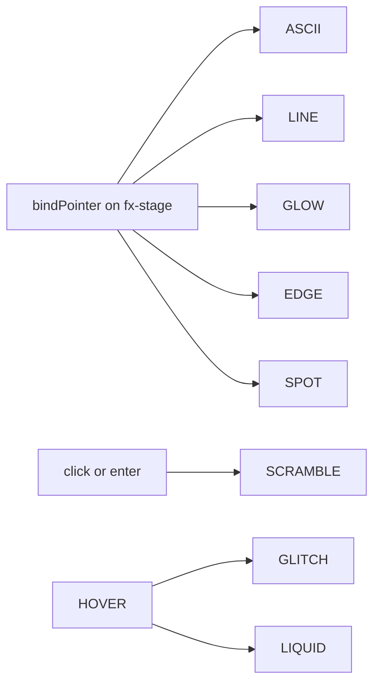

# feat: Brandbook — all effects cursor-reactive + interactive

**Target repo:** zbs-site  
**Created:** 2026-07-14  
**Origin:** Nik after v2.5: “все разделы с эффектами должны реагировать на курсор и быть интерактивными.”

**Product Contract preservation:** bootstrap from user request. Builds on brandbook v2.5 (`artifacts/brandbook/brandbook.html`).

---

## Goal Capsule

Every **effects surface** in the brandbook (effects lab stages + other live motion demos) must **react to the cursor** and support **at least one intentional interaction** (hover, drag, pointer-driven parameter, click). No auto-only wallpaper demos. Reduced-motion still disables thrash while keeping a static readable state.

---

## Problem Frame

| Stage (current) | Cursor / interactive now | Gap |
|-----------------|--------------------------|-----|
| Hero ASCII | glyph thrash in radius | keep / polish intensity labels |
| FX: ASCII | same | ok |
| FX: Line draw | auto loop only | **no cursor** |
| FX: Signal glow | idle pulse only | **no cursor** |
| FX: Scramble timeline | auto packs only | **no pointer trigger** |
| FX: Glitch nav | hover glitch | ok (verify + dose) |
| FX: Liquid glass | glare + tabs | ok (verify) |
| FX: Holo edge card | static CSS | **no cursor / drag** |
| FX: Spotlight | pointer radial | ok |
| Hero 3D card | drag + specular | ok (ensure pointer light always) |
| Explainer stage | autoplay + buttons | add **pointer scrub** optional |
| Bento stages | mostly static UI | light **hover motion** on demos |

**Success:** Nik can scrub the cursor across the effects lab and **each tile visibly responds**; click/drag where it makes sense; captions document the interaction.

---

## Product Contract

### Actors
- **A1 Nik** — judges “feels alive under cursor.”
- **A2 Implementer** — single-file brandbook JS/CSS.

### Requirements
| ID | Requirement |
|----|-------------|
| R1 | **Inventory complete:** every `.fx` stage and hero motion surface has a defined pointer reaction + interaction. |
| R2 | **No auto-only lab stages:** ambient loop may continue, but pointer must change at least one visible parameter (position, speed, intensity, glyph, path, phase). |
| R3 | **Shared pointer helper** (one module pattern in the page script): local coords + normalized 0–1 + active/leave — used by stages. |
| R4 | **Per-stage interaction map** implemented (see HTD table). |
| R5 | **UX chrome:** each `fx-meta` includes a one-line **Interact:** hint (what to do with the cursor). |
| R6 | **prefers-reduced-motion:** stop continuous thrash; snap to static or click-to-step only. |
| R7 | **file://** / dual theme still work; no new npm deps. |
| R8 | Guardrails note: “effects lab = interactive specimens.” |

### Acceptance Examples
| ID | Example |
|----|---------|
| AE1 | Move cursor over **line-draw** stage → path endpoint or control point follows / redraws toward pointer. |
| AE2 | Move cursor over **glow** → orb follows pointer (or pulls toward it with lag). |
| AE3 | Hover/click **scramble** stack → re-scramble that line / pack (not only auto timer). |
| AE4 | Drag **holo edge** demo → tilt + specular (reuse 3D card light grammar, lighter). |
| AE5 | Existing: ASCII thrash, spotlight, glitch, liquid, 3D card still work. |
| AE6 | Reduced-motion: no endless auto scramble thrash; stages still show final state. |

### Scope Boundaries
**In:** `artifacts/brandbook/brandbook.html` (+ README one paragraph). Effects lab + polish on hero ASCII / 3D / explainer/bento hover.

**Deferred:**
- Port interactions to production landing components.
- WebGL / new libraries.

**Outside identity:** particle networks, matrix rain, mono marquee.

### Assumptions
- “Разделы с эффектами” = primarily **§ Effects lab** + **hero live field/card**; bento/explainer get light pointer feedback where cheap.
- Liquid glass remains a **lab specimen**, not page chrome (v2.5 decision stands).

---

## Key Technical Decisions

1. **Pointer kit, not 8 ad-hoc listeners**  
   `bindPointer(el, {onMove, onLeave, onDown, onUp})` returning normalized `{x,y,nx,ny,inside}` in element space.  
   *Why:* consistent leave/reset; less bugs.

2. **Per-stage interaction map is the contract**  
   Implement exactly the map below; do not invent a 9th effect unless replacing a dead one.

3. **Autoplay becomes secondary**  
   Auto loops may run when pointer is idle; on pointer enter, prefer pointer-driven control.  
   *Why:* interactive first.

4. **Holo edge → mini 3D / pointer tilt**  
   Static edge demo becomes pointer-tilt plate (CSS transform or light GSAP) with holo rim still 4px.  
   *Why:* currently the least interactive.

5. **Line draw → pointer-attracted path**  
   Rebuild path from fixed start through pointer-influenced mid/end, or dashoffset + tip follows cursor on the path. Prefer **mid control point = pointer** for clear feedback.

6. **Scramble → pointerenter re-trigger**  
   Keep timeline packs, but re-fire scramble on enter/click (like nav).

---

## High-Level Technical Design

### Interaction map (authoritative)

| Stage | Cursor reaction | Extra interaction |
|-------|-----------------|-------------------|
| Hero ASCII / FX ASCII | glyph thrash + density in radius | (already) |
| Line draw | mid/end of path tracks pointer | leave → settle idle curve |
| Signal glow | orb position lerps to pointer | scale ∝ speed or distance-to-center |
| Scramble | — | pointerenter / click re-scramble |
| Glitch nav | hover glitch (keep) | optional pointer x-jitter intensity |
| Liquid glass | glare follows pointer (keep) | tab click (keep) |
| Holo edge | rotateX/Y from pointer | drag optional |
| Spotlight | radial follows pointer (keep) | label updates nx,ny |
| 3D card | drag + specular (keep) | pointermove light without drag |
| Explainer | — | hover pause (keep); optional scrub on stage x |
| Bento demos | subtle hover lift / bar highlight | phone row hover hot |



---

## Implementation Units

### U1. Pointer kit + Interact labels

**Goal:** Shared pointer binding; every fx-meta shows how to interact.  
**Requirements:** R1, R3, R5  
**Dependencies:** none  
**Files:**
- modify `artifacts/brandbook/brandbook.html` (JS helper + copy lines under each `.dose` or new `.interact`)

**Approach:** Implement `bindPointer`; add `.interact` mono line: e.g. `Interact: move · leave resets`.

**Test scenarios:**
- Happy: leave stage fires onLeave for bound stages.
- Edge: touch pointer still works on mobile if present.

**Verification:** all fx cards have Interact line.

---

### U2. Line draw + glow + scramble interactive

**Goal:** Close the three biggest auto-only gaps.  
**Requirements:** R2, R4, AE1–AE3  
**Dependencies:** U1  
**Files:**
- modify `artifacts/brandbook/brandbook.html` (SVG path logic, glow CSS/JS, scramble triggers)

**Approach:**
- **Line:** single path with control point from pointer; rAF redraw or update `d` attribute; idle animation when outside.
- **Glow:** absolute orb; `transform: translate` to pointer with lerp 0.12–0.2; pulse intensity from velocity.
- **Scramble:** on `pointerenter` / click on stage, call existing scramble runner for all lines or one line under cursor.

**Test scenarios:** AE1–AE3; reduced-motion static path + no auto loop thrash.

**Verification:** visual QA three stages.

---

### U3. Holo edge pointer-tilt + spotlight/glitch/liquid audit

**Goal:** No static edge; polish stages that already partly work.  
**Requirements:** R2, R4, AE4, AE5  
**Dependencies:** U1  
**Files:**
- modify `artifacts/brandbook/brandbook.html`

**Approach:**
- **Holo edge:** pointer-driven `rotateX/Y` (clamp ±18°) + optional specular gradient position; keep 4px holo rim.
- **Spotlight / liquid / glitch:** ensure leave resets; document Interact; fix any dead zones (`pointer-events` on children).
- Confirm stages capture events on full `.fx-stage` hit area.

**Test scenarios:** AE4–AE5.

**Verification:** no stage is static under cursor.

---

### U4. Hero / explainer / bento light interactivity

**Goal:** Rest of “effects-bearing” sections feel consistent.  
**Requirements:** R1, R4  
**Dependencies:** U2, U3  
**Files:**
- modify `artifacts/brandbook/brandbook.html`

**Approach:**
- Hero ASCII: already thrash — optionally show subtle crosshair or status mono “cursor on field”.
- 3D card: pointermove updates specular even without drag (already partial).
- Explainer: keep pause on hover; add horizontal pointer scrub of scene index optional (map nx → scene 1–3) **if** cheap; else skip.
- Bento: `.phone-row:hover` hot line; perf bars highlight nearest bar to pointer x.

**Test scenarios:**
- Happy: hover bento phone rows → highlight.
- Edge: explainer scrub doesn’t fight autoplay badly (pause while scrubbing).

**Verification:** Nik can interact outside lab too.

---

### U5. Guardrails + README

**Goal:** Document interactive lab rule.  
**Requirements:** R6, R8  
**Dependencies:** U2–U4  
**Files:**
- modify `artifacts/brandbook/brandbook.html` (rules/ledger)
- modify `artifacts/brandbook/README.md`

**Approach:** Rules: every effects specimen must respond to cursor; list Interact map summary.

**Test expectation:** none — docs.  
**Verification:** README section “Interactive effects.”

---

## Dependencies / Sequencing

```
U1 → (U2 ∥ U3) → U4 → U5
```

---

## Risks & Mitigation

| Risk | Mitigation |
|------|------------|
| Too many rAF loops | One rAF only for stages with active pointer; idle low-cost CSS |
| Nested pointer-events steal events | bind on `.fx-stage`; children `pointer-events: none` where needed except controls |
| Overstimulation | Dose: thrash only while inside stage; leave resets |
| Reduced motion ignored | Gate all thrash on `reduce` |

---

## Verification Contract

1. file:// open brandbook.  
2. Cursor through **every** effects lab tile → visible response (AE1–AE5).  
3. Interact labels present (AE / R5).  
4. Reduced-motion: no continuous auto thrash.  
5. Dual theme + Bayside nav non-regression.

## Definition of Done

- [ ] All FX stages pointer-reactive  
- [ ] Interact hints on each  
- [ ] Holo edge no longer static  
- [ ] Line + glow + scramble interactive  
- [ ] README + guardrails updated  

---

## Sources & Research

- Current specimen: `artifacts/brandbook/brandbook.html` (v2.5 motion)  
- Landing patterns: `components/scramble-text.tsx`, `components/ascii-bg.tsx`  
- Prior plan: `docs/plans/2026-07-14-002-feat-brandbook-motion-theme-plan.md`  

**External research:** not load-bearing; pointer-lerp and SVG control-point interaction are standard.

---

## Open Questions (defaults)

1. Explainer scrub by x? **Default: pause on hover only unless U4 is still thin.**  
2. Remove auto scramble packs entirely? **Default: keep idle auto; pointer re-triggers.**  
