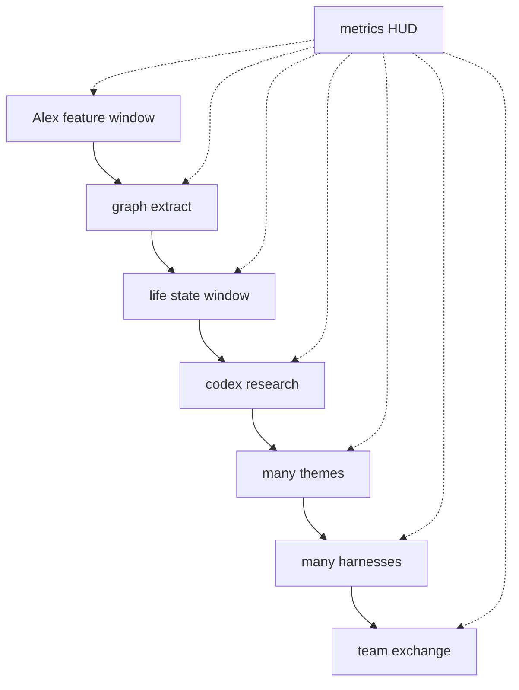

# feat: Brandbook — 5 FX, video/3D bg, lab zoom-out story + Pulse metrics

**Target repo:** zbs-site  
**Created:** 2026-07-14  
**Origin:** Nik `/lfg` — expand brandbook with more SVG/ASCII effects, generated video backgrounds, GSAP 3D field, and lab-style progressive zoom-out narrative (Alex → themes → graph → harnesses → team exchange) with live Pulse metrics (tokens, compound insights, fewer iterations).

**Product Contract preservation:** bootstrap from user rant. Extends brandbook v2.5 specimen.

---

## Goal Capsule

Grow `artifacts/brandbook/` into a **motion + story specimen** that:

1. Adds **≥5 new SVG/ASCII effects** (cursor-reactive where possible).  
2. Ships **several background media assets** (video or looping canvas stand-ins if gen blocked) + a **GSAP-driven 3D-ish background field**.  
3. Adds a **lab-grade progressive reveal** (“thought opening”): zoom-out scenes from one person/one theme → graph meaning → many themes → harnesses → multi-person skill/workflow exchange.  
4. Runs a **metrics strip** throughout: Pulse quality (person + team), tokens saved, insights compounded, fewer dev iterations.

---

## Problem Frame

Brandbook has effects lab + bento + theme wipe, but lacks:

- Depth of **new effect specimens** (still feels short of “wow under cursor”).  
- **Cinematic / video** backgrounds (only still Higgsfield moods + ASCII).  
- **Product story animation** matching `public/lab.html` energy (staged zoom, multi-scene thought).  
- **Proof metrics** tied to the story (not abstract marketing).

---

## Product Contract

### Actors
- **A1 Nik** — judges face, story clarity, metric honesty tone.  
- **A2 Implementer** — brandbook HTML/CSS/JS + assets.  

### Requirements
| ID | Requirement |
|----|-------------|
| R1 | **≥5 new SVG and/or ASCII effects** in effects lab (or adjacent demo strip), each with short caption + interact hint. Prefer cursor-reactive. |
| R2 | **Background pack:** ≥2 looping video or video-like backgrounds under `artifacts/brandbook/assets/bg/` (Higgsfield Seedance or equivalent; if blocked, high-quality canvas/CSS loop labeled as stand-in). Wire at least one as optional full-bleed behind a section. |
| R3 | **GSAP 3D background:** depth parallax / floating planes or wireframe field (CSS 3D + GSAP), not a second particle network. |
| R4 | **Story stage “Alex zoom-out”** with ≥5 beats: (1) Alex writing a feature → meaning into graph; (2) life reflection theme; (3) Codex interface research; (4) multi-theme + multi-harness; (5) multi-person practice/skill/workflow exchange. Zoom-out / progressive densify (lab grammar). |
| R5 | **Metrics HUD** always visible during story (and optionally sticky mini): person Pulse score, team Pulse score, tokens reduced, insights compounded, iteration cut %. Numbers can be **illustrative fixtures** clearly labeled `[fixture]` — not fake production claims. |
| R6 | Story objects **appear to support statements** (not decorative noise): windows, graph nodes, harness chips, people avatars, exchange arrows. |
| R7 | file:// works; dual theme + Bayside nav non-regression. |
| R8 | README documents new sections + how to regenerate media. |

### Acceptance Examples
| ID | Example |
|----|---------|
| AE1 | Effects lab lists ≥5 **new** stages beyond pre-004 inventory. |
| AE2 | At least one section shows a video/`<video>` or documented canvas stand-in as background. |
| AE3 | GSAP 3D bg moves (parallax / float) without matrix/particles. |
| AE4 | Story auto-advances (or controls) through ≥5 beats; captions match Alex narrative. |
| AE5 | Metrics strip updates per beat (even if fixture curves). |
| AE6 | `[fixture]` label visible on metrics. |

### Scope Boundaries
**In:** brandbook HTML/CSS/JS, assets under `artifacts/brandbook/assets/`, README, optional Higgsfield generation.

**Deferred:**
- Live `app/page.tsx` / production lab rewrite.  
- Real Pulse telemetry wiring (fixtures only).  
- Perfect photo-real video of named people (no Soul without assets).

**Outside:**
- Mono marquee, particle nets, matrix rain.  
- Claiming real customer metrics without source.

### Assumptions
- “Alex” is a **persona** (not a real PII dump).  
- Metrics are **story fixtures** for brand motion, labeled.  
- Video gen may fail offline; canvas/CSS fallback is shippable.  
- Interactive-effects plan (003) remains desired but this plan **does not block** on full 003; new stages should still be interactive when cheap.

---

## Key Technical Decisions

1. **Story section = new `#story-lab` after explainer / before or after parts**  
   Dedicated stage machine (like lab.html), brand tokens, no Inter.  

2. **Metrics = fixture curves keyed by beat index**  
   e.g. tokensSaved[beat], compound[beat], iterations[beat]. Animate number tween on beat change. Label `[fixture]`.  

3. **Five new effects (named set)**  
   1. SVG constellation / graph grow under cursor  
   2. ASCII rain columns (dense, cursor clears) — *careful not matrix cliché: monochrome low-opacity data rain only if distinct*  
   Prefer instead: **ASCII mask reveal** under cursor  
   3. SVG plotter multi-path draw on enter  
   4. Grid perspective floor + pointer warp  
   5. Glyph bloom (cursor expands ring of mono chars)  

4. **Video backgrounds**  
   Try Higgsfield video for abstract dark cyan fields (no faces). Store `assets/bg/*.mp4` + poster png.  

5. **GSAP 3D bg**  
   Layer of absolute cards/planes with depth, slow float, pointer parallax on section.  

6. **No new npm** — local GSAP already in brandbook.  

---

## High-Level Technical Design

### Story beat map

| Beat | Visual | Caption idea | Metrics nudge |
|------|--------|--------------|---------------|
| 0 | Alex · one window “shipping feature” | One person, one thread | person Pulse baseline |
| 1 | Extract → graph node “auth decision” | Meaning pulled into graph | +insights compound |
| 2 | Second window “life / state” | Same person, different state | retrieval quality ↑ |
| 3 | Codex / research UI interfaces | Harness: research | tokens path starts ↓ |
| 4 | Multi theme chips | Several of Alex’s themes | compound ++ |
| 5 | Multi harness chips | Claude / Codex / Cursor / Slack | cross-harness |
| 6 | Multi people + exchange arrows | Practices, skills, workflows | **team** Pulse + iteration cut |

Zoom-out: `scale` of stage field decreases as density increases (lab s2 grammar).



---

## Implementation Units

### U1. Asset shell + 5 new interactive SVG/ASCII effects

**Goal:** Expand effects lab by ≥5 stages.  
**Requirements:** R1  
**Files:** `artifacts/brandbook/brandbook.html`  
**Approach:** Add stages with Interact hints; pointer-bind where easy.  
**Verification:** count new stages ≥5.

### U2. GSAP 3D background field

**Goal:** Depth parallax background for one major section (story or hero).  
**Requirements:** R3  
**Files:** brandbook.html CSS/JS  
**Approach:** layered planes / cards; GSAP float; pointer parallax.  
**Verification:** AE3.

### U3. Background video pack

**Goal:** ≥2 media files + wire optional section bg.  
**Requirements:** R2  
**Files:** `artifacts/brandbook/assets/bg/*`, brandbook.html, README  
**Approach:** Higgsfield video gen abstract; fallback canvas.  
**Verification:** AE2; file:// paths relative.

### U4. Story lab stage machine (Alex zoom-out)

**Goal:** Progressive reveal narrative R4/R6.  
**Requirements:** R4, R6, AE4  
**Files:** brandbook.html  
**Patterns:** `public/lab.html` scene machine  
**Approach:** scenes + captions + dots + prev/next + autoplay; zoom-out density.  
**Verification:** AE4 manual.

### U5. Metrics HUD fixtures

**Goal:** Person/team Pulse, tokens, compound, iterations.  
**Requirements:** R5, AE5, AE6  
**Files:** brandbook.html  
**Approach:** sticky or in-stage panel; tween numbers per beat; `[fixture]`.  
**Verification:** numbers change on beat; fixture labeled.

### U6. README + guardrails + ledger

**Goal:** Document story, metrics honesty, media regen.  
**Requirements:** R8  
**Files:** README.md, brandbook rules section  
**Verification:** paths documented.

---

## Sequencing

```
U1 ∥ U3
U2 after U1 shell
U4 → U5
U6 last
```

---

## Risks

| Risk | Mitigation |
|------|------------|
| Fake metrics read as real | Hard `[fixture]` + guardrail “never claim unmeasured” |
| Matrix cliché | Avoid classic green rain; use brand mono + cyan thrash |
| Video gen fail | Canvas stand-in + README gap |
| File size huge mp4 | Short loops, compress; optional external later |

---

## Verification Contract

1. file:// brandbook opens.  
2. AE1–AE6.  
3. Nav scramble + theme wipe non-regression.  
4. Story ≥5 beats + metrics fixture label.

## Definition of Done

- [ ] ≥5 new effects  
- [ ] GSAP 3D bg present  
- [ ] ≥1 video or documented stand-in bg  
- [ ] Alex zoom-out story lab  
- [ ] Metrics HUD fixture  
- [ ] README updated  

---

## Sources

- `public/lab.html` — multi-scene zoom grammar  
- `artifacts/brandbook/brandbook.html` — current specimen  
- Plans 001–003 brandbook lineage  
- Higgsfield for optional video (if available)

**Open defaults:** Metrics are illustrative fixtures; Alex is persona; video fallback allowed.
